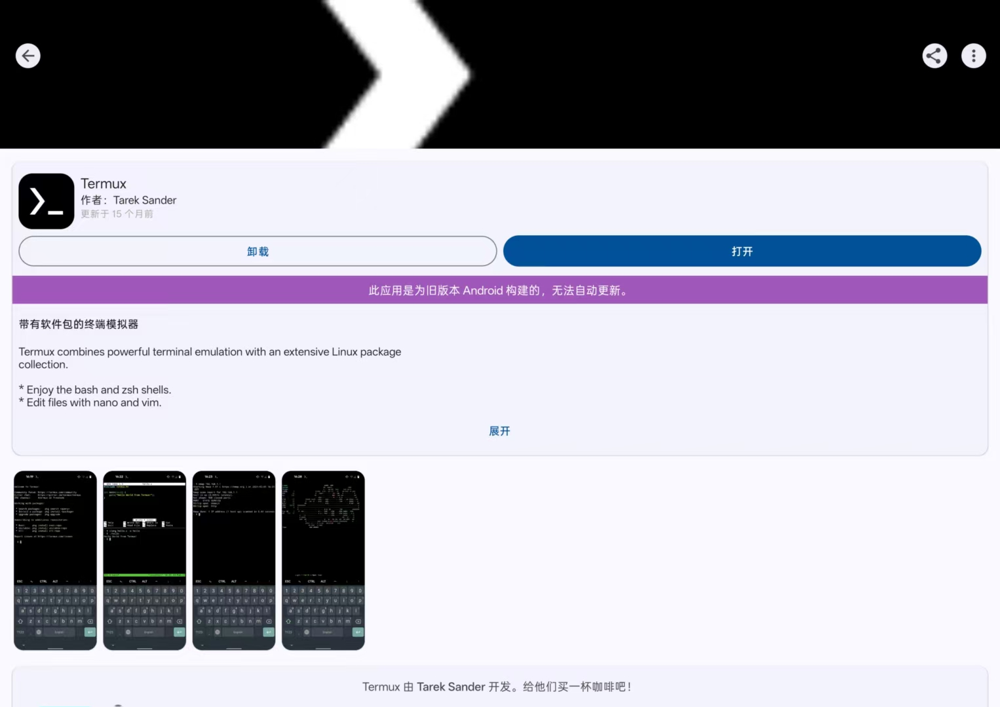
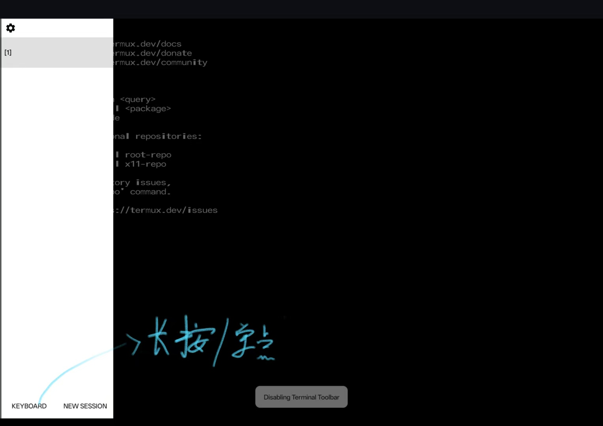
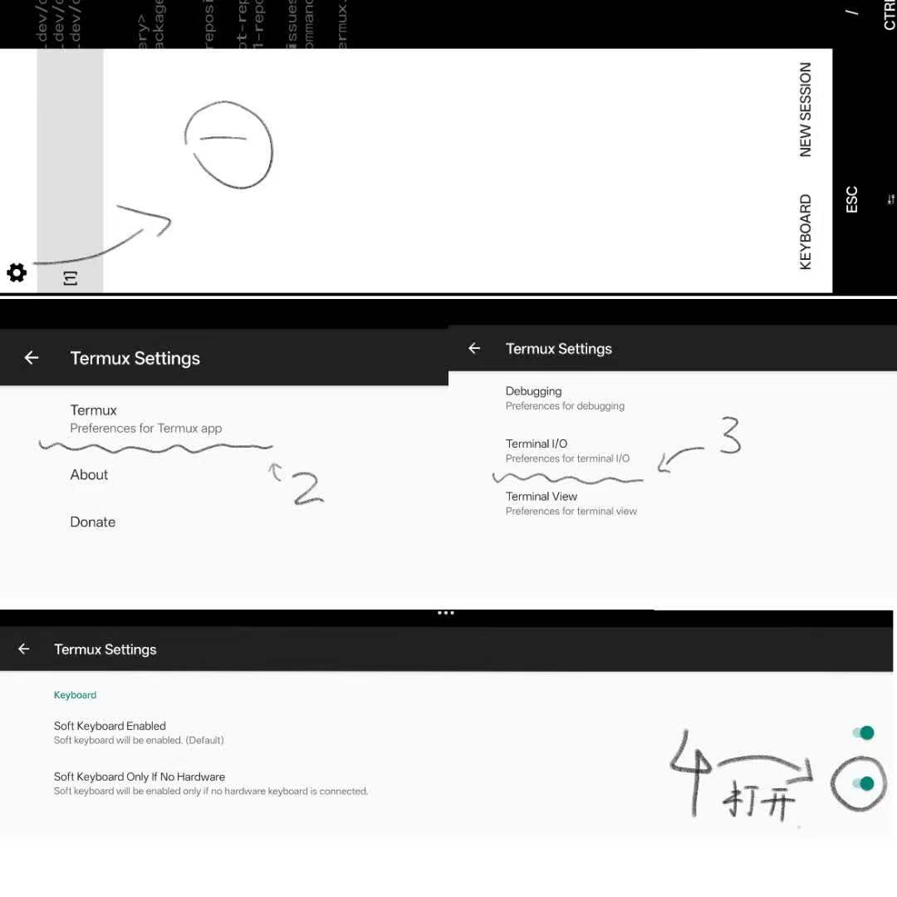

# 第 1 篇：安装 Termux 与 Ubuntu

> 目标：让你的平板拥有一个 Linux 系统。
> 全程在平板上完成，不需要电脑，不需要 root。

## 第一步：安装 F-Droid（应用商店）

Termux 在普通应用商店里版本太旧，所以要通过 F-Droid 安装最新版。

1. 用平板浏览器打开网址：`https://f-droid.org`并下载

> 说明：F-Droid 是一个只收录免费开源软件的应用商店，
> 我们只用它来装 Termux。

## 第二步：通过 F-Droid 安装 Termux

1. 打开刚装好的 F-Droid
2. 搜索「Termux」
3. ⚠️ 注意：**只安装名字就叫「Termux」的那个** 
   不要装 Termux:Styling、Termux:API 等其他名字带前缀的
4. 点击安装，等待完成
   - 如果弹出「此应用专为旧版安卓打造」→ 点「仍然安装」（正常现象）

> 说明：Termux 是一个 Linux 终端模拟器，
> 它会给你一个真正的 Linux 命令行环境，
> 本文后面的一切都建立在它之上。

## 第三步：首次启动与观感优化

### 3.1 打开 Termux

你会看到一个黑底白字的界面，最后一行是 `~ $` 提示符。
这就是你的 Linux 命令行——你打命令，它执行。

### 3.2 观感优化（强烈推荐）

刚打开的 Termux 用起来可能不太舒服，如果想要‘沉浸感’建议先做几个调整：

**① 调整文字大小**

- 双指 放大/缩小 调整终端屏幕大小（初始的文字好小 看不清！）


**② 隐藏屏幕下方的虚拟按键**

- 长按 Termux 界面紧贴左边 向右滑→ 弹出菜单（多试几次 有时候就很难滑出 ）
- 找到「Keyboard」选项 → 关闭虚拟键盘/关闭软键盘 
- （如果你没有实体键盘，建议保留，虚拟按键能提供 ESC、CTRL 等键）

**③ 隐藏状态栏（可选）**

```
echo "fullscreen = true" > ~/.termux/termux.properties
```

> 说明：这行命令把「全屏模式」写入 Termux 配置文件。
> 执行后**完全关闭 Termux 再重新打开**才生效。

**④ 有键盘时自动隐藏软键盘**

- 呼出 Termux 菜单 → 找到软键盘相关选项关闭 
- 这样每次进入 Termux 不会自动弹出软键盘挡屏幕(前提是你得有键盘！！)

### 3.3 换国内镜像源（下载提速）

输入：

```
termux-change-repo
```

（新版界面）按提示操作：

- 方向键选中「Mirror group」开头的 → 回车
- 然后选中「( ) Mirrors in Chinese Mainland」（中国大陆镜像）
- 空格键勾选 → 回车

之后它会**自动测试所有大陆镜像、自动挑选最快的那个**，
并自动刷新软件列表（看到 `Picking mirror: ...` 即完成）。

> 说明：新版 termux-change-repo 会自动选择镜像；
> 旧版需要手动选清华/中科大，两种界面都很正常，
> 认准「Chinese Mainland」就好。

### 3.4 更新所有软件包

```
pkg update && pkg upgrade -y
```

过程中如果弹出类似 `openssl.cnf (y/l/n/o/d/z) [default=n]?` 的询问：
**全部按回车（或输入 n 回车）**，保留当前配置即可。

> 说明：这是包管理器在问「要不要替换配置文件」，
> 选默认的 n（不替换）最安全。

## 第四步：安装 Ubuntu

### 4.1 安装 proot-distro（Termux 里唯一需要装的工具）

```
pkg install proot-distro -y
```

> 说明：Termux 的职责就是把 Ubuntu「搬」进平板，
> 所以它自己只需要装 proot-distro 这一个工具。
> Python、Git、Vim 等开发工具全部装在 Ubuntu 里（下一篇）。

### 4.2 安装 Ubuntu 24.04

```
proot-distro install ubuntu:24.04
```

⚠️ **注意：必须带版本号 `:24.04`！**
新版 proot-distro 不支持不带版本号的写法。

等待下载完成（约 1 分钟，视网速而定）。

### 4.3 登录 Ubuntu

```
proot-distro login ubuntu
```

成功标志：提示符从 `~ $` 变成 `root@localhost:~#`。
恭喜，你现在在 Ubuntu 系统里了。

### 4.4 设置自动登录（可选但推荐）

不设置的话，每次打开 Termux 都要手动敲 `proot-distro login ubuntu`。

**先退出 Ubuntu 回到 Termux：**

```
exit
```

然后在 Termux 环境下执行：

```
echo "proot-distro login ubuntu" >> ~/.bashrc
```

以后每次打开 Termux，会自动进入 Ubuntu。

> 说明：~/.bashrc 是 bash 的配置文件，
> 每次打开终端都会自动执行里面的内容。
> 如果想手动控制，跳过此步即可。（不推荐！）

## 第五步：Ubuntu 内更新与装工具

在 Ubuntu 里依次执行：

```
apt update && apt upgrade -y
```

> 如果这条命令报 404 错误或者非常慢，说明源有问题，删后台重进一下不行就换成清华镜像：

```
cp /etc/apt/sources.list.d/ubuntu.sources /etc/apt/sources.list.d/ubuntu.sources.bak
sed -i 's@http://ports.ubuntu.com/ubuntu-ports@https://mirrors.tuna.tsinghua.edu.cn/ubuntu-ports@g' /etc/apt/sources.list.d/ubuntu.sources
apt update
```

> **没有报错的话直接继续下一步。**

接着安装工具：

```
apt install python3 git curl wget vim build-essential -y
```
### 可能出现的询问：时区选择

apt 装软件过程中如果弹出：

Geographic area: （选 Asia 可能是-5）
Time zone:       （选 Shanghai 可能是-69）

> 说明：这是 Ubuntu 首次配置时区，中国用户选 Asia → Shanghai。

验证：

```
python3 --version
```

> 说明：现在你的 Ubuntu 里有了 Python、Git、Vim 等工具，
> 可以开始学 Linux 命令了。 [02-搭建VSCode开发环境](/02-搭建VSCode开发环境.md) 教你把 VS Code 装进平板（本地部署）。
