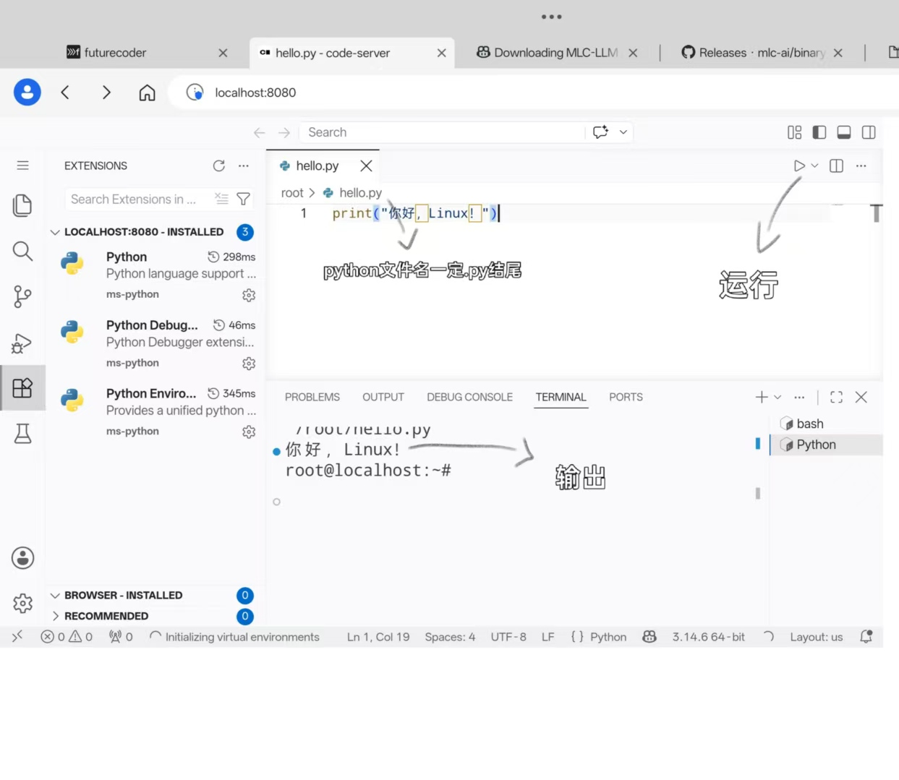

# 第 2 篇：搭建 VS Code 开发环境

> 目标：让平板拥有完整的 VS Code 代码编辑器。
> 原理：code-server 是 VS Code 的网页版——
> 平板在后台跑一个服务，浏览器打开就能用。

## 第一步：准备工作

### 1.1 关闭电池优化（防止 Termux 被杀）

打开平板设置，按路径操作：

```
设置 → 电池 → 更多设置 / 电池优化
→ 找到 Termux
→ 设为「不优化」
```

> 说明：安卓系统为了省电会杀掉后台应用。
> 如果不关闭优化，Termux 切到后台几分钟就会被杀死，
> 你的 VS Code 服务就断了。

### 1.2 确认你在 Ubuntu 里

提示符应该是 `root@localhost:~#`。
如果不是，先执行：

```
proot-distro login ubuntu
```

## 第二步：安装 code-server

### 2.1 安装 curl（下载工具）

```
apt update && apt install curl -y
```

### 2.2 运行官方安装脚本

```
curl -fsSL https://code-server.dev/install.sh | sh
```

等待 1-2 分钟。

> 说明：这行命令下载并执行 code-server 官方安装脚本，
> 它会自动识别平板（Android端）的 ARM64 架构，下载对应版本。

### 2.3 让系统能找到 code-server **（直接跳到2.4 可能不需要这一步）。**

脚本把程序装在了 `~/.local/bin/`，但这个目录默认不在搜索路径里，
所以执行下面三行**（可能不需要这一步 直接跳到2.4）**：

```
mkdir -p ~/.local/bin
echo 'export PATH="$HOME/.local/bin:$PATH"' >> ~/.bashrc
source ~/.bashrc
```

> 说明：PATH 是系统找命令的「搜索路线图」。
> 把 ~/.local/bin 加进去，输入 code-server 时系统才知道去哪找。

### 2.4 验证安装

```
code-server --version
```

显示版本号即成功。

> ⚠️ **如果没有显示版本号**，而是提示 `code-server: command not found`，执行：

```
find / -name code-server -type f 2>/dev/null
```

会找到程序的实际位置（形如 `.../code-server-x.x.x/bin/code-server`），
然后创建快捷方式（把「找到的路径」替换成上一步输出的真实路径）：

```
ln -s 找到的路径 ~/.local/bin/code-server
source ~/.bashrc
code-server --version
```

> **版本号正常显示的话，跳过上面这段，直接下一步。**

## 第三步：启动 VS Code

```
code-server --auth none --bind-addr 0.0.0.0:8080
```

看到这行输出即启动成功：

```
HTTP server listening on http://0.0.0.0:8080
```

> 说明：
> --auth none = 不需要密码（只在平板本机用，安全）
> --bind-addr 0.0.0.0:8080 = 监听 8080 端口

⚠️ 注意：此时终端会「卡住」不返回提示符——这是正常的！
服务器正在前台运行，等浏览器来访问。不要按 Ctrl+C。

## 第四步：浏览器打开 VS Code

平板浏览器（Chrome）地址栏输入：

```
http://localhost:8080
```

你会看到完整的 VS Code 界面：左边文件树、右边编辑器、底部终端。

> 说明：localhost = 本机。你访问的是平板自己跑的服务。

## 第五步：安装 Python 扩展

1. 左侧栏点击「扩展」图标（四个方块）
2. 搜索 `Python` → 安装 Microsoft 出品的 Python 扩展
3. 可选：搜索 `Chinese` → 安装中文语言包

## 第六步：写第一个 Python 程序

1. 按 `Ctrl + N` 新建文件（接实体键盘）
2. 输入：

```
print("你好，Linux！")
```

3. 按 `Ctrl + S` 保存，文件名填 `hello.py`
4. 右上角点 ▶ 运行按钮（或底部终端输入 `python3 hello.py`）

看到输出 `你好，Linux！` ——恭喜，你的平板就是开发机了! 

## 第七步：简化启动（一劳永逸）

### 7.1 先停掉当前运行的 VS Code

回到 Termux，按 `Ctrl + C` 退出前台运行的 code-server。

### 7.2 设置三字母命令 + 后台运行

以后不想每次输一长串命令、也不想终端被占用？
设置一个三字母命令，让 VS Code 在后台跑：

```
echo "alias vsc='nohup code-server --auth none --bind-addr 0.0.0.0:8080 > /dev/null 2>&1 &'" >> ~/.bashrc
source ~/.bashrc
```

> 说明（逐个拆解）：
> - `alias vsc='...'` = 起个别名，以后输 `vsc` 就代表后面一整串 你也能把‘vsc’改成自己想改的
> - `nohup` = 让程序不依赖终端，终端关了它也继续跑
> - `code-server --auth none --bind-addr 0.0.0.0:8080` = 启动 VS Code 服务
> - `> /dev/null 2>&1` = 把运行日志丢弃，不刷屏
> - `&` = 放到后台运行，不占用你的输入光标
> - `source ~/.bashrc` = 让配置立刻生效

### 7.3 以后的使用流程

启动 VS Code：

```
vsc
```

然后浏览器打开 `http://localhost:8080`。

关闭 VS Code：

```
pkill code-server
```

> 说明：VS Code 后台运行占用的资源很少，不关也不影响使用。
> 也可以直接清掉 Termux 后台（从最近任务划掉）来终止它。

## 附：日常使用流程总结

```
1. 打开 Termux（自动进 Ubuntu）
2. 输入 vsc
3. 浏览器打开 localhost:8080
4. 写代码
5. 用完：pkill code-server（或直接不管它）
```
## 如还想知道平板（Android）环境还可以做些什么请看[03-平板还能做什么.md](/03-平板还能做什么.md) 只是作为了解 且都已经跑通并验证