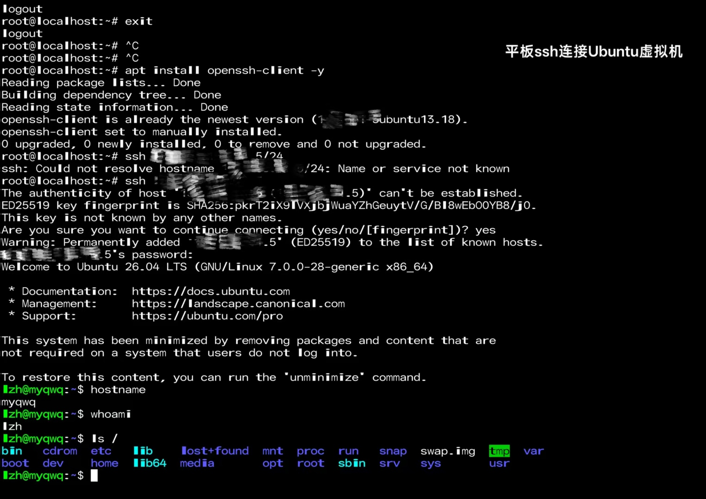
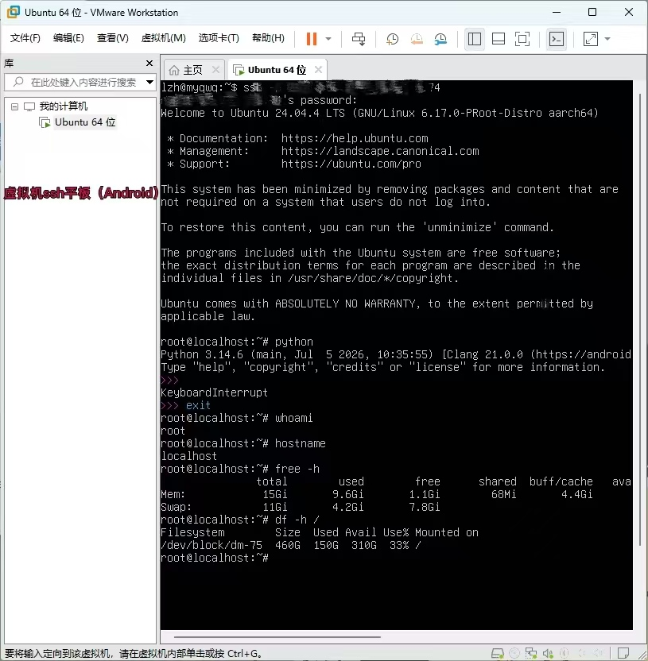
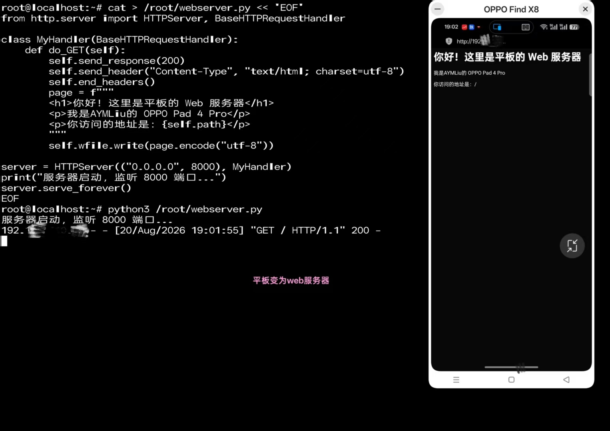
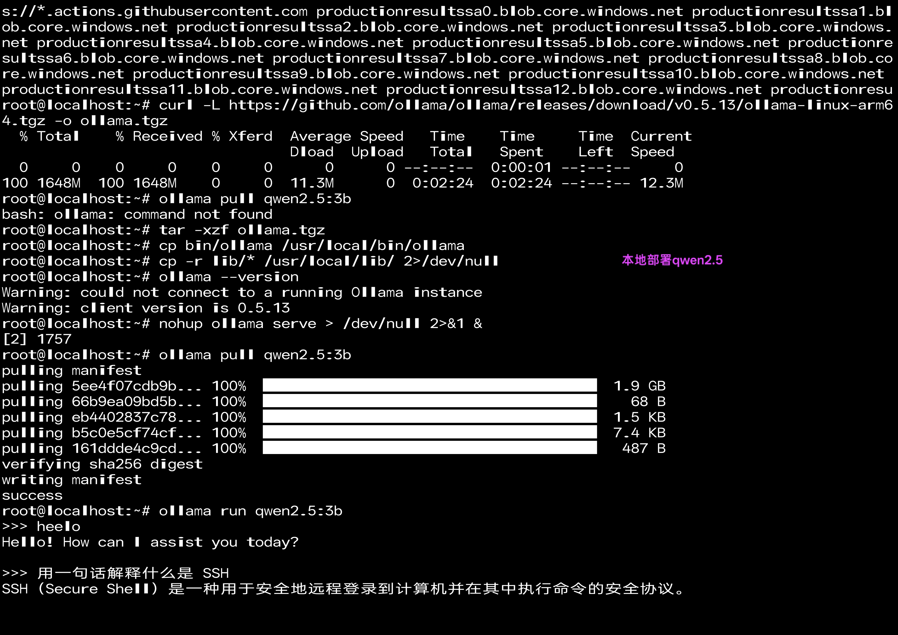
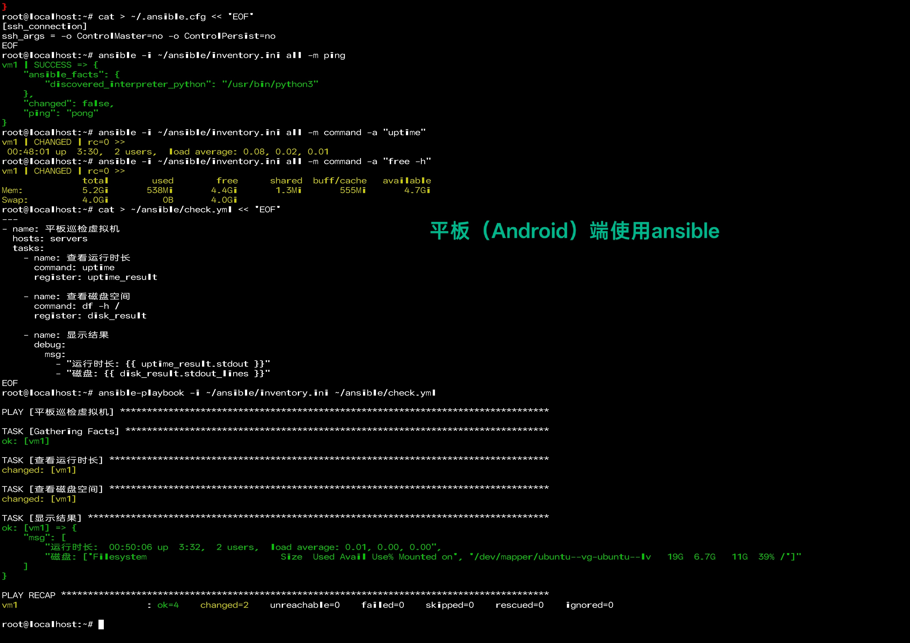
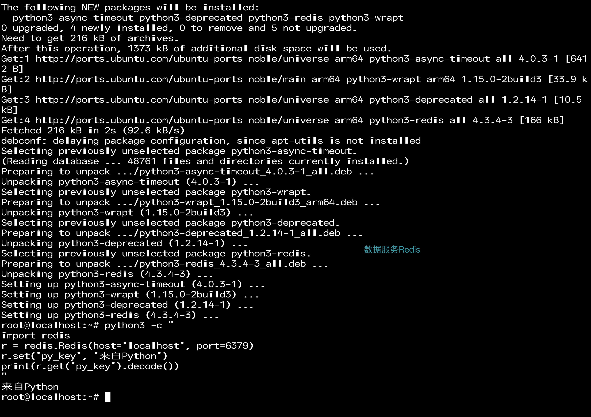
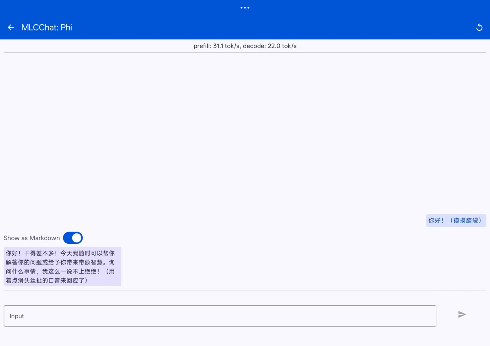

# 第 3 篇：平板还能做什么

环境装好了，但平板（Android）的能力不止写代码
以下是由我亲自验证：

| 能力 | 说明 | 验证状态 |
|------|------|:--:|
| 🐍 Python 编程 | 平板上的 Python 3 环境 | ✅ |
| 🐧 Linux 命令练习 | 完整的 Ubuntu 系统 | ✅ |
| 💻 VS Code 开发 | 浏览器打开完整 VS Code | ✅ |
| 🔗 SSH 客户端 | 从平板远程管理其他机器 | ✅ | 
| 🔗 SSH 服务器 | 别的设备远程管理平板 | ✅ | 
| 🌐 Web 服务器 | 平板跑网站，局域网访问 | ✅ | 
| 🖥️ 远程开发 | 电脑浏览器访问平板的 VS Code | ✅ |
| 🤖 本地 AI | Ollama 跑大模型（3B 参数） | ✅ | 
| ⚙️ 自动化运维 | Ansible 远程管理服务器 | ✅ | 
| 🗄️ 数据服务 | Redis 数据库 | ✅ | 
| ⚡ NPU 加速 | 骁龙 NPU 跑模型（MLCChat） | ✅ |  

### 🐍 Python 编程
平板上运行 Python 3，随时练习编程

### 🐧 Linux 命令练习
完整的 Ubuntu 24.04 系统，真正的 Linux 环境

### 💻 VS Code 开发
浏览器打开完整 VS Code，和电脑一样的编辑器

### 🔗 SSH 双向连接
平板既能远程管理别的机器，也能被远程管理
 

### 🌐 Web 服务器
平板跑网站，同一 WiFi 下的设备都能访问

### 🤖 本地 AI
Ollama 运行 3B 参数大模型，离线对话

### ⚙️ 自动化运维
Ansible 控制台，远程指挥服务器

### 🗄️ 数据服务
Redis 数据库，Python 直接读写

### ⚡ NPU 加速
骁龙 NPU 跑模型，硬件级 AI 加速

## 结论

在计算、网络、开发、AI、运维、数据等六个维度，
平板能轻替代电脑完成入门级工作

这些进阶的具体步骤不在本教程范围内 过程较为繁琐 如有需求可以联系我进行交流！希望这些基础开发能够给你带来一些**不一样的思路！**
欢迎提 Issue 交流
